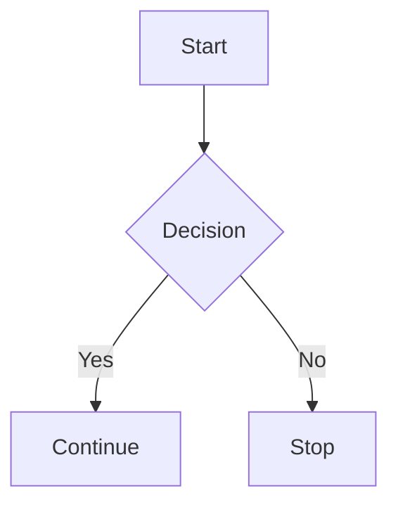
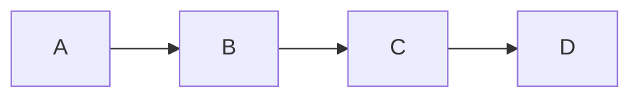
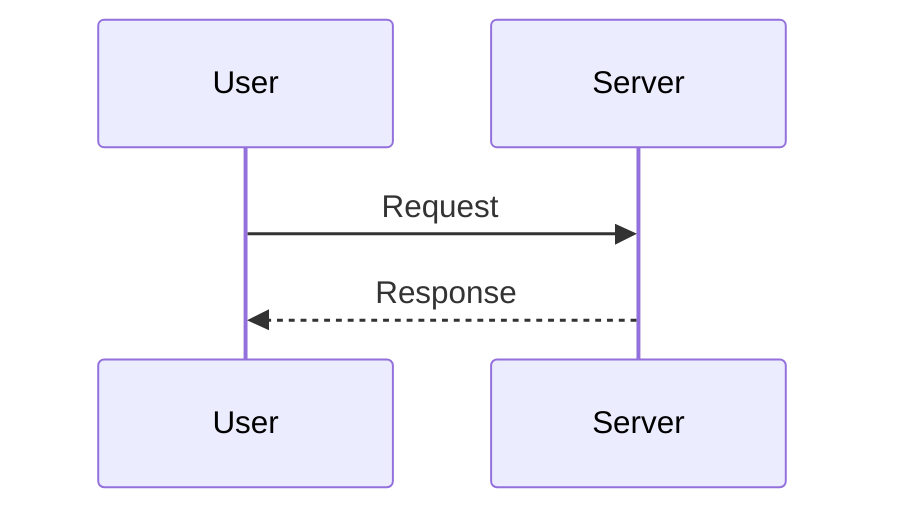
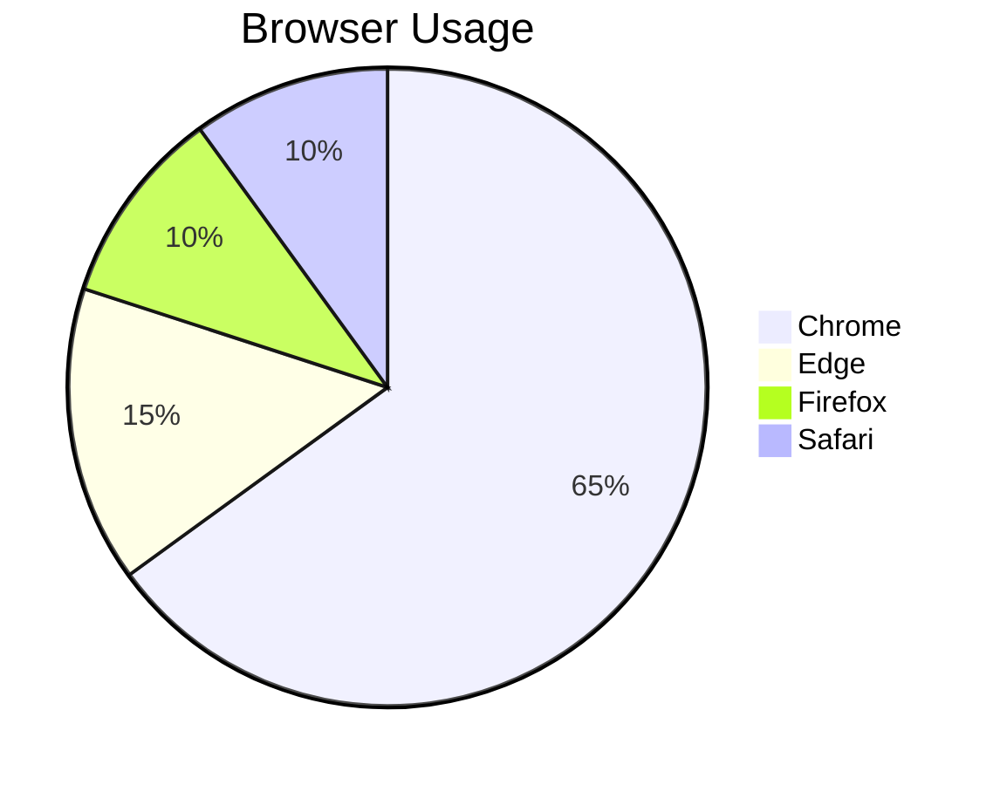

# Markdown Syntax Guide

A complete Markdown example covering the most commonly used syntax.

---

# Heading 1

## Heading 2

### Heading 3

#### Heading 4

##### Heading 5

###### Heading 6

---

## Paragraph

This is a normal paragraph.

This is another paragraph with **bold**, _italic_, and `inline code`.

---

## Emphasis

_Italic text_

_Italic text_

**Bold text**

**Bold text**

**_Bold and italic_**

~~Strikethrough~~

<u>Underline (HTML)</u>

---

## Blockquotes

> This is a blockquote.
>
> It can span multiple lines.

> ### Nested Quote
>
> > This is a nested quote.

---

## Horizontal Rule

---

---

---

---

## Lists

### Unordered List

- Apple
- Banana
- Orange
  - Mango
  - Grapes

### Ordered List

1. First
2. Second
3. Third
   1. Nested Item
   2. Nested Item

### Task List

- [x] Learn Markdown
- [x] Practice formatting
- [ ] Master Markdown

---

## Links

[OpenAI](https://openai.com)

<https://github.com>

Email: <example@email.com>

---

## Images


---

## Inline Code

Use the `fetch()` API to make HTTP requests.

---

## Code Blocks

### JavaScript

```javascript
// Print a message
function greet(name) {
  console.log(`Hello ${name}`);
}

greet('World');
```

### HTML

```html
<h1>Hello World</h1>
<p>This is HTML.</p>
```

### CSS

```css
body {
  font-family: Arial, sans-serif;
  background: #f5f5f5;
}
```

### JSON

```json
{
  "name": "John",
  "age": 25,
  "country": "India"
}
```

### Bash

```bash
npm install
npm run dev
```

---

## Tables

| Name | Age | Country |
| ---- | --: | ------- |
| Ravi |  24 | India   |
| John |  28 | USA     |
| Sara |  30 | UK      |

### Alignment

| Left | Center | Right |
| :--- | :----: | ----: |
| A    |   B    |     C |
| 1    |   2    |     3 |

---

## Escaping Characters

\*This is not italic\*

\# This is not a heading

---

## Keyboard Keys

<kbd>Ctrl</kbd> + <kbd>C</kbd>

<kbd>⌘</kbd> + <kbd>Shift</kbd> + <kbd>P</kbd>

---

## Footnotes

Here is a sentence with a footnote.[^1]

[^1]: This is the footnote text.

---

## Definition List

Markdown : A lightweight markup language.

HTML : HyperText Markup Language.

---

## Emoji

😀 😎 🚀 ❤️ 🎉 🔥 📚 💻

You can also use GitHub emoji:

:smile: :rocket: :heart:

---

## Highlight (HTML)

<mark>Highlighted text</mark>

---

## Superscript and Subscript (HTML)

H<sub>2</sub>O

x<sup>2</sup>

---

## Details / Collapse

<details>
<summary>Click to expand</summary>

This content is hidden until expanded.

- Item 1
- Item 2
- Item 3

</details>

---

## Mermaid Diagram



---

## Flowchart



---

## Sequence Diagram



---

## Pie Chart



---

## Math (GitHub Compatible)

Inline:

$E = mc^2$

Block:

$$
\int_a^b f(x)\,dx
$$

---

## HTML Support

<div style="padding:10px;border:1px solid #ccc;">
<strong>HTML works in many Markdown renderers.</strong>
</div>

---

## Mixed Example

### Shopping List

- [x] Milk
- [x] Bread
- [ ] Eggs

### Code

```python
for i in range(5):
    print(i)
```

### Table

| Product | Price |
| ------- | ----: |
| Laptop  | $1000 |
| Mouse   |   $25 |

### Quote

> Simplicity is the soul of efficiency.

### Link

https://www.markdownguide.org/

### Image


---

## End 🎉
